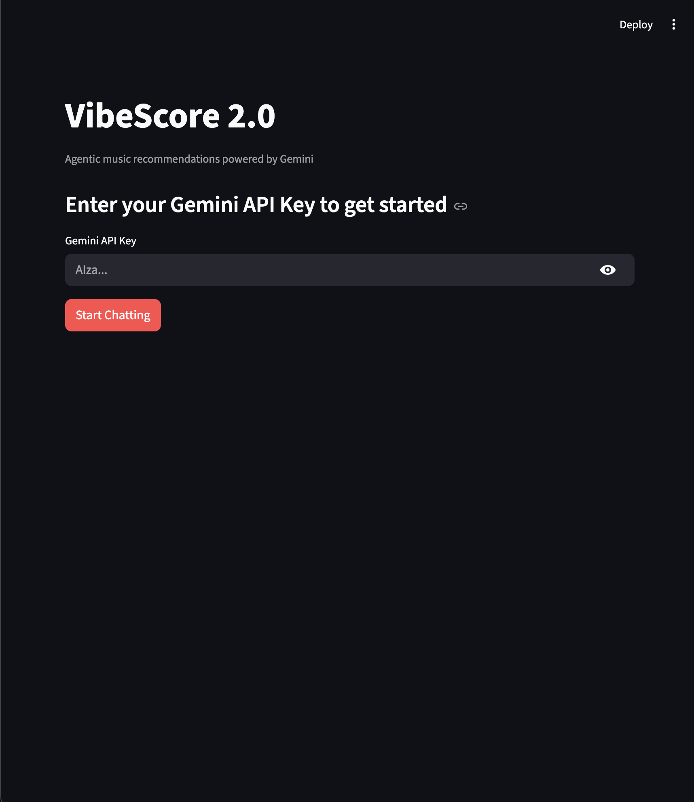
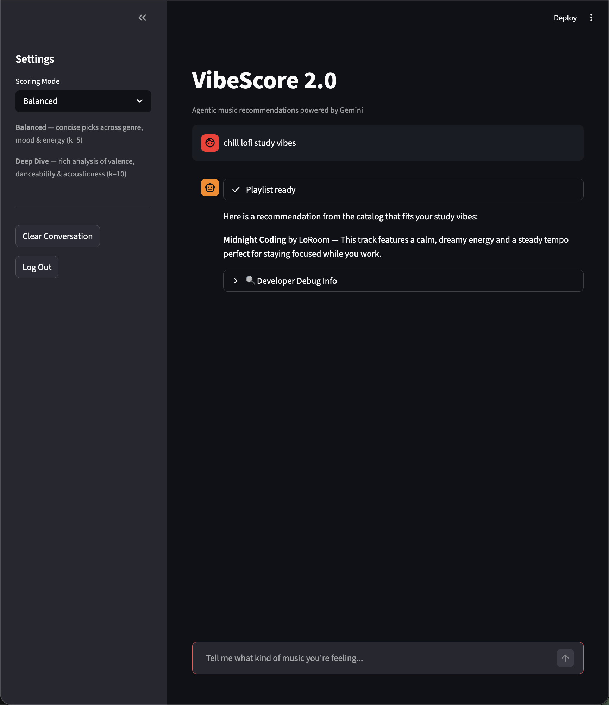
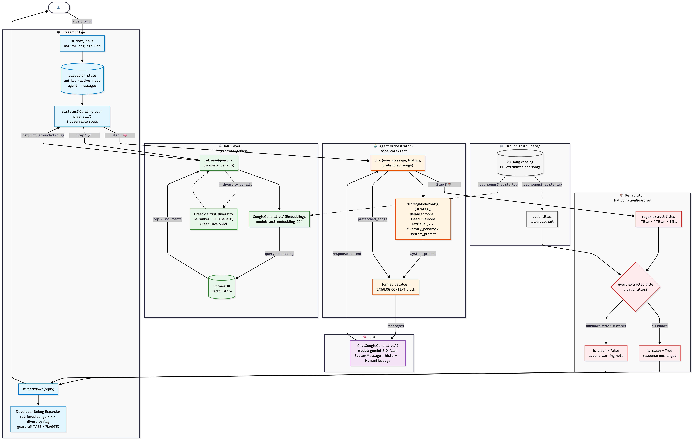

# VibeScore 2.0 — Semantic RAG Music Recommender

> **Module 4 Upgrade** — Evolves VibeScore 1.0 (Module 3) from static CSV math into a fully agentic, conversational recommendation system powered by Google Gemini and ChromaDB.

---

## What Changed From VibeScore 1.0

VibeScore 1.0 (Module 3) was a rule-based, CLI recommender. It scored every song against a hard-coded user profile using explicit arithmetic weights (e.g., +2.0 for genre match, +1.0 for mood match) and returned a sorted top-5 list. It was transparent and deterministic, but it could not understand natural language, had no memory of conversation context, and required you to pre-define your preferences in code.

| Dimension | VibeScore 1.0 (Module 3) | VibeScore 2.0 (Module 4) |
|---|---|---|
| Input | Structured `UserProfile` dict | Free-text natural language |
| Retrieval | Hand-crafted numeric scoring | Semantic vector search (ChromaDB) |
| AI layer | None | Google Gemini 3.0 Flash (LLM) |
| Memory | Stateless CLI | Multi-turn Streamlit chat session |
| Hallucination control | N/A — math can't hallucinate | `HallucinationGuardrail` cross-checks every title |
| Interface | Terminal table | Streamlit chat UI with mode selector |

The core `songs.csv` catalog and the Strategy pattern concept both carry forward. Everything else is rebuilt on a RAG foundation.

---

## Agentic Workflow — Gemini as a Semantic DJ

VibeScore 2.0 treats Gemini 3.0 Flash as a **Semantic DJ**: it does not just filter a list, it plans and curates a playlist by reasoning about the emotional arc, energy curve, and genre blend of a set of candidate songs.

The full pipeline on every user message:

```
User vibe (natural language)
        │
        ▼
  ChromaDB vector search
  (semantic similarity over embedded song metadata)
        │
        ▼
  Top-k grounded candidates injected into system prompt
        │
        ▼
  Gemini 3.0 Flash (LLM)
  — reads CATALOG CONTEXT
  — reasons about mood, energy, valence, danceability
  — writes playlist with explanations
        │
        ▼
  HallucinationGuardrail validation
        │
        ▼
  Safe response returned to user
```

Because retrieval happens before generation, Gemini only ever "sees" real songs from the catalog — it curates rather than invents.

**Scoring modes** (Strategy pattern, carried forward from 1.0) configure how the Semantic DJ behaves:

- **Balanced Mode** (`k=5`, diversity off) — concise picks that spread across genre, mood, and energy. One or two sentences per song.
- **Deep Dive Mode** (`k=10`, diversity on) — rich analysis. Gemini discusses valence (musical positivity), danceability, acousticness, tempo, and explains the emotional arc of the playlist as a whole. The greedy artist-diversity re-ranker (ported from VibeScore 1.0's `-1.0` penalty logic) runs before retrieval results reach the LLM, so no artist repeats across the 10 candidates.

---

## Reliability Guardrails

### HallucinationGuardrail

LLMs can confidently recommend songs that do not exist. The `HallucinationGuardrail` class prevents this from reaching the user:

1. **After** Gemini generates a response, the guardrail scans it for quoted or bold-formatted strings using three regex patterns: `"Title"`, `**Title**`, `'Title'`.
2. Every extracted string is cross-checked against `valid_titles` — a lowercase set built directly from `data/songs.csv` at startup. This set is the single source of truth.
3. If any extracted title is absent from the catalog **and** is ≤ 8 words long (plausible song title, not a sentence fragment), it is flagged.
4. Flagged responses are returned with an appended warning note rather than silently corrected, so the user knows the model attempted to go off-catalog.
5. Clean responses pass through unchanged.

```
songs.csv  →  SongKnowledgeBase.valid_titles  →  HallucinationGuardrail
                                                         ▲
                                                  Gemini response
```

Because the guardrail reads from the same CSV that the vector store was built from, there is no way for a song to pass retrieval but fail validation, or vice versa.

---

## Project Structure

```
vibescore-v2/
├── app.py                  # Streamlit UI only — no logic
├── src/
│   ├── agent_system.py     # SongKnowledgeBase, VibeScoreAgent,
│   │                       # HallucinationGuardrail, ScoringModeConfig
│   └── recommender.py      # VibeScore 1.0 core (Song, load_songs, strategies)
├── data/
│   └── songs.csv           # 20-song catalog — ground truth for guardrail
├── tests/
│   └── test_recommender.py
└── requirements.txt
```

---

## Setup

### Prerequisites

- Python 3.10+
- A [Google AI Studio](https://aistudio.google.com/app/apikey) API key (free tier works)

### Install

```bash
# 1. Clone and enter the project
git clone <repo-url>
cd vibescore-v2

# 2. Create and activate a virtual environment
python3 -m venv .venv
source .venv/bin/activate      # Mac / Linux
.venv\Scripts\activate         # Windows

# 3. Install dependencies
pip install -r requirements.txt
```

### Run

```bash
streamlit run app.py
```

The app opens in your browser. Enter your Gemini API key on the landing screen — it is stored only in `st.session_state` for the duration of your session and never written to disk.

### Tests

```bash
pytest tests/
```

The test suite covers the VibeScore 1.0 scoring and recommendation logic in `src/recommender.py`. All 2 tests should pass.

---

## Loom Walkthrough

> [**\[Walkthrough link\]**](https://www.loom.com/share/9062faa07ddc451eb5b5bd59f2adb0f5)

---

## 🖼️ System in Action

### 1. Secure Onboarding

*Figure 1: Gemini API Key gate for secure sessions.*

### 2. Semantic Search & Observability

*Figure 2: Multi-step observable workflow and natural language interaction.*

### 3. Deep Dive & Debugging

*Figure 3: Full transparency into ChromaDB retrieval and attribute analysis.*

### 4. Reliability Guardrail

*Figure 4: Automated conflict detection against the songs.csv ground truth.*

## Architecture Decisions

**Why ChromaDB over keyword scoring?**
VibeScore 1.0's scoring loop required exact string matches for genre and mood. A user asking for "something melancholic and cinematic" would score zero against the `mood=moody` tag. ChromaDB with `text-embedding-004` embeddings maps both the query and the song metadata into the same vector space, so semantic proximity drives retrieval instead of string equality.

**Why keep the Strategy pattern?**
The original Strategy pattern encoded "which features matter most" as swappable scoring weights. In 2.0, the same abstraction encodes "how should the Semantic DJ reason and how many candidates should it see." The pattern is a natural fit for both problems — it keeps mode-specific behavior isolated and makes adding new modes (e.g., a `WorkoutMode` with high-energy bias) a single class addition.

**Why does the guardrail append a note rather than strip the response?**
Silently removing content is a form of deception. Annotating the response lets the user see that the model tried to go off-catalog and judge the recommendation quality themselves. Transparency is more useful than a clean-looking but quietly censored output.
